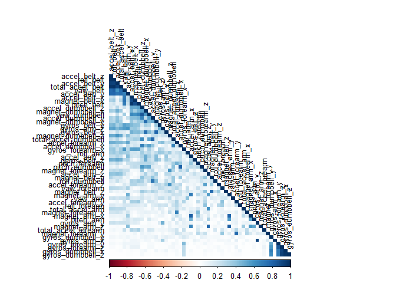
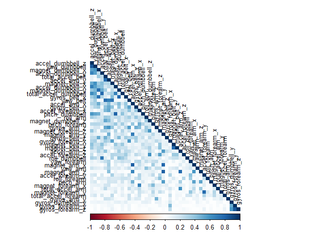

1. Overview
-----------

This is the final project completed as part of Practical Machine
Learning course which is part of Data Science Specialization. The goal
is to use data from accelerometers on the belt, forearm, arm, and
dumbell of 6 participants and predict the manner (classe variable) in
which they did the exercise.

2. Background
-------------

Using devices such as Jawbone Up, Nike FuelBand, and Fitbit it is now
possible to collect a large amount of data about personal activity
relatively inexpensively. These type of devices are part of the
quantified self movement - a group of enthusiasts who take measurements
about themselves regularly to improve their health, to find patterns in
their behavior, or because they are tech geeks. One thing that people
regularly do is quantify how much of a particular activity they do, but
they rarely quantify how well they do it. In this project, your goal
will be to use data from accelerometers on the belt, forearm, arm, and
dumbell of 6 participants. They were asked to perform barbell lifts
correctly and incorrectly in 5 different ways.

3. Load Required Libraries and Data Sets
----------------------------------------

    require(data.table)
    require(dplyr)
    require(caret)   
    require(psych)  
    require(corrplot)  
    require(C50)
    train_raw<-fread("training.csv")  

4.Clean and Pre-Process Data
----------------------------

After initial analysis made on the CSV Training file, it was observed
that the file has some bad data with \#DIV/0! values. Column with these
values are removed. All variable with NA values are set to 0 using
remove\_NA function.

    good_train<-grep("#DIV/0!",train_raw[,1:dim(train_raw)[2]])
    training<-train_raw[,-good_train,with=FALSE]
    remove_NA<-function(df=data.table)
    {
            getcolClass<-sapply(df,class)
            for (i in 1:length(getcolClass))
            {
                    na_row_indices<-which(is.na(df[,i,with=FALSE]))
                    if (getcolClass[i]  =="character" | getcolClass[i]  =="factor")
                            df[na_row_indices,i]<-""
                    else if (getcolClass[i]=="numeric" | getcolClass[i]=="integer" )
                            df[na_row_indices,i]<-0
                    
                    
            }
            df
            
    }
    training<-remove_NA(training)

Remove columns 1:7 as these are Invalid predictors and convert classe
variable to factor

    training<-as.data.frame(training[,-c(1:7)])
    training$classe<-as.factor(training$classe)
    dim(training)

    ## [1] 19622   120

Identify and remove Near Zero Variance predictors as these may cause the
model to crash or the fit to be unstable.

    zero_var<-nearZeroVar(training)
    training<-training[,-zero_var]
    dim(training)

    ## [1] 19622    53

5.Correlation Analysis
----------------------

Correlation Analysis plays an important role in improving the
performance of a model. Use cor function to find the correlation between
predictors.Exclude 53rd column which is the classe variable.

    corr_matrix<-abs(cor(training[,-53]))

Use corrplot to visualize correlations.

    ##      Min.   1st Qu.    Median      Mean   3rd Qu.      Max. 
    ## 0.0000018 0.0330200 0.1042000 0.1697000 0.2412000 0.9920000

Find highly correlated variables (&gt;0.85) and exclude them from our
data set.Examine the summary after filtering highly correlated
predictors.

    high_corr <- findCorrelation(corr_matrix, cutoff = .85)
    training<-training[,-high_corr]
    dim(training)

    ## [1] 19622    45

    corr_matrix<-abs(cor(training[,-45]))
    corrplot(corr_matrix, order = "FPC", method = "color", type = "lower",tl.cex = 0.8, tl.col = rgb(0, 0, 0))

    summary(corr_matrix[upper.tri(corr_matrix)])

    ##      Min.   1st Qu.    Median      Mean   3rd Qu.      Max. 
    ## 0.0000018 0.0414800 0.1097000 0.1632000 0.2299000 0.8491000

6. Create Testing and Training Data Sets.
-----------------------------------------

    inTrain<-createDataPartition(training$classe,p=0.7,list=FALSE)
    train<-training[inTrain,]
    test<-training[-inTrain,]

7. Model 1: Fit a decision tree.
--------------------------------

Model fit a decision tree using C5.0 using K fold cross validation with
3 folds. This can be done using trainControl function in caret package.
Also create a grid of paramters to optimize the model. This method will
select the optimal model and that model will be used to predict the
results on test set.

    tr_ctrl<-trainControl(method="cv",number=3,selectionFunction = "oneSE")
    grid<-expand.grid(.model="tree",.trials=c(1,5,10,15,20,25,30,35),.winnow="FALSE")
    set.seed(300)

Train the model. As you have observed in the code, we have used kappa
characteristic to adjust accuracy. This characteric is important for
datasets with severe class imbalance. High accuracy is obtained by
simply guessing the most frequent class.

    set.seed(300)
    modFit<-train(classe~.,data=train,method="C5.0",trcontrol=tr_ctrl,metric="Kappa",tuneGrid=grid)

    modFit

    ## C5.0 
    ## 
    ## 13737 samples
    ##    44 predictor
    ##     5 classes: 'A', 'B', 'C', 'D', 'E' 
    ## 
    ## No pre-processing
    ## Resampling: Bootstrapped (25 reps) 
    ## Summary of sample sizes: 13737, 13737, 13737, 13737, 13737, 13737, ... 
    ## Resampling results across tuning parameters:
    ## 
    ##   trials  Accuracy   Kappa    
    ##    1      0.9287513  0.9099383
    ##    5      0.9705111  0.9627127
    ##   10      0.9798488  0.9745196
    ##   15      0.9825846  0.9779782
    ##   20      0.9835396  0.9791868
    ##   25      0.9842981  0.9801460
    ##   30      0.9848422  0.9808343
    ##   35      0.9850701  0.9811218
    ## 
    ## Tuning parameter 'model' was held constant at a value of tree
    ## 
    ## Tuning parameter 'winnow' was held constant at a value of FALSE
    ## Kappa was used to select the optimal model using  the largest value.
    ## The final values used for the model were trials = 35, model = tree
    ##  and winnow = FALSE.

The best model was selected where accuracy was 0.9857291. This model
will be used to predict values on our test set.

    modPred<-predict(modFit,test[,-45])

    confusionMatrix(modPred,test$classe)

    ## Confusion Matrix and Statistics
    ## 
    ##           Reference
    ## Prediction    A    B    C    D    E
    ##          A 1667    1    1    1    0
    ##          B    4 1135    7    3    1
    ##          C    2    2 1006    5    0
    ##          D    1    0   12  952    0
    ##          E    0    1    0    3 1081
    ## 
    ## Overall Statistics
    ##                                         
    ##                Accuracy : 0.9925        
    ##                  95% CI : (0.99, 0.9946)
    ##     No Information Rate : 0.2845        
    ##     P-Value [Acc > NIR] : < 2.2e-16     
    ##                                         
    ##                   Kappa : 0.9905        
    ##  Mcnemar's Test P-Value : NA            
    ## 
    ## Statistics by Class:
    ## 
    ##                      Class: A Class: B Class: C Class: D Class: E
    ## Sensitivity            0.9958   0.9965   0.9805   0.9876   0.9991
    ## Specificity            0.9993   0.9968   0.9981   0.9974   0.9992
    ## Pos Pred Value         0.9982   0.9870   0.9911   0.9865   0.9963
    ## Neg Pred Value         0.9983   0.9992   0.9959   0.9976   0.9998
    ## Prevalence             0.2845   0.1935   0.1743   0.1638   0.1839
    ## Detection Rate         0.2833   0.1929   0.1709   0.1618   0.1837
    ## Detection Prevalence   0.2838   0.1954   0.1725   0.1640   0.1844
    ## Balanced Accuracy      0.9976   0.9967   0.9893   0.9925   0.9991

Overall accuracy using 3 fold cross validation and kappa characteristic
was 0.9918.

8. Model 2: Fit a Naive Bayesian Model
--------------------------------------

Now lets examine how Naive Bayes model performs with a different cross
validation method: Boot Strap Sampling with number=3

    tr_ctrl_nb<-trainControl(method="boot",number=3)
    set.seed(320)
    modFitNB<-train(classe~.,data=train,method="nb",trcontrol=tr_ctrl_nb)

Predict the results on test set
    
    modPredNB<-predict(modFitNB,test[,-45])
    confusionMatrix(modPredNB,test$classe)

    ## Confusion Matrix and Statistics
    ## 
    ##           Reference
    ## Prediction    A    B    C    D    E
    ##          A 1363  159   94   82   45
    ##          B   26  706   73    3   92
    ##          C  110  164  774  147   47
    ##          D  166   97   80  687   44
    ##          E    9   13    5   45  854
    ## 
    ## Overall Statistics
    ##                                          
    ##                Accuracy : 0.7449         
    ##                  95% CI : (0.7336, 0.756)
    ##     No Information Rate : 0.2845         
    ##     P-Value [Acc > NIR] : < 2.2e-16      
    ##                                          
    ##                   Kappa : 0.6774         
    ##  Mcnemar's Test P-Value : < 2.2e-16      
    ## 
    ## Statistics by Class:
    ## 
    ##                      Class: A Class: B Class: C Class: D Class: E
    ## Sensitivity            0.8142   0.6198   0.7544   0.7127   0.7893
    ## Specificity            0.9098   0.9591   0.9037   0.9214   0.9850
    ## Pos Pred Value         0.7820   0.7844   0.6232   0.6397   0.9222
    ## Neg Pred Value         0.9249   0.9131   0.9457   0.9424   0.9540
    ## Prevalence             0.2845   0.1935   0.1743   0.1638   0.1839
    ## Detection Rate         0.2316   0.1200   0.1315   0.1167   0.1451
    ## Detection Prevalence   0.2962   0.1529   0.2110   0.1825   0.1573
    ## Balanced Accuracy      0.8620   0.7895   0.8290   0.8170   0.8871

Accuracy of this model is only 0.74292. Hence, our we use decision tree
to rpedict results on the final validation test set

9 Read the test set given in the assignment
-------------------------------------------

Read the data and use same techniques used for cleaning the training set

    test_raw<-read.csv("testing.csv")
    test_raw<-as.data.frame(test_raw)
    gettestClass<-sapply(test_raw,class)
    getLogicalCols<-grep("logical",gettestClass)
    test_raw[,getLogicalCols]<-apply(test_raw[,getLogicalCols],2,function(x) as.numeric(x))

    test_raw<-as.data.table(test_raw)
    testing<-remove_NA(test_raw)
    testing<-as.data.frame(testing[,-c(1:7)])

10 Predict the classe variable using the Decision Tree Model
------------------------------------------------------------

    predict_final<-predict(modFit,testing)
    testing$classe<-predict_final
    testing[,c("problem_id","classe")]

    ##    problem_id classe
    ## 1           1      B
    ## 2           2      A
    ## 3           3      B
    ## 4           4      A
    ## 5           5      A
    ## 6           6      E
    ## 7           7      D
    ## 8           8      B
    ## 9           9      A
    ## 10         10      A
    ## 11         11      B
    ## 12         12      C
    ## 13         13      B
    ## 14         14      A
    ## 15         15      E
    ## 16         16      E
    ## 17         17      A
    ## 18         18      B
    ## 19         19      B
    ## 20         20      B
